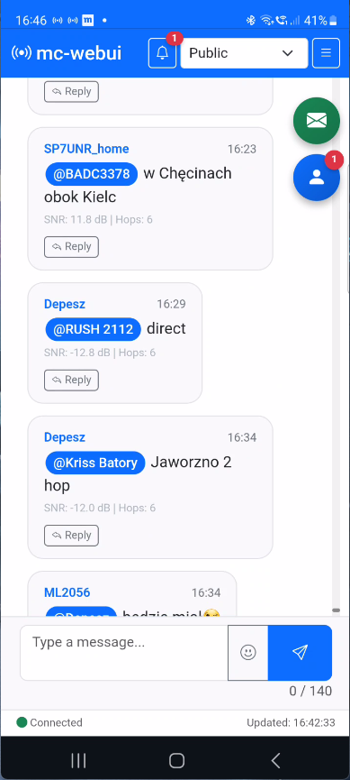
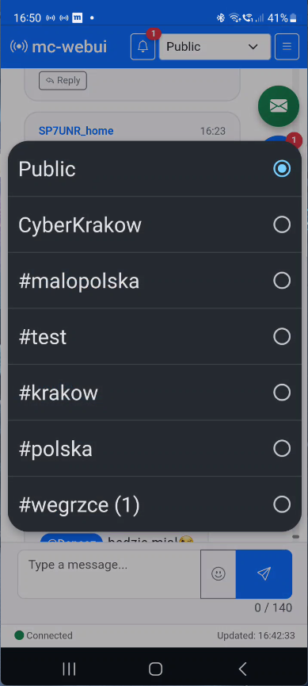
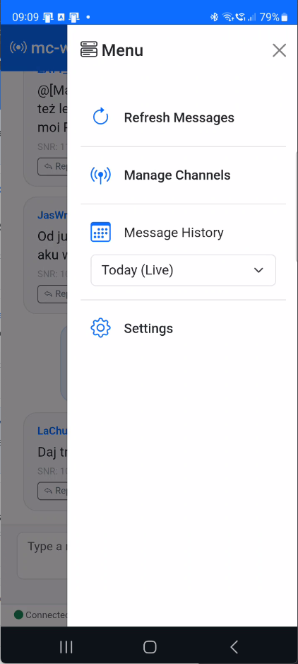
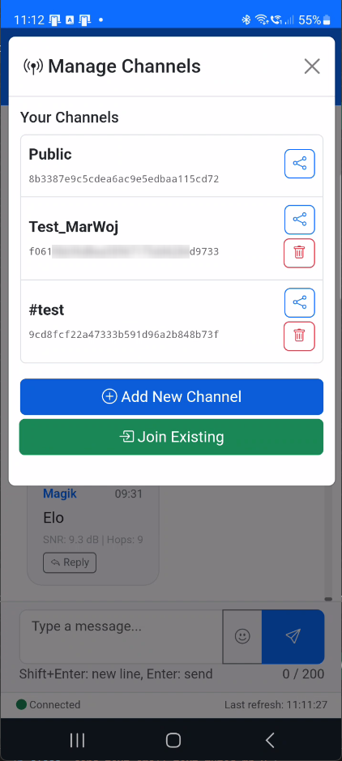
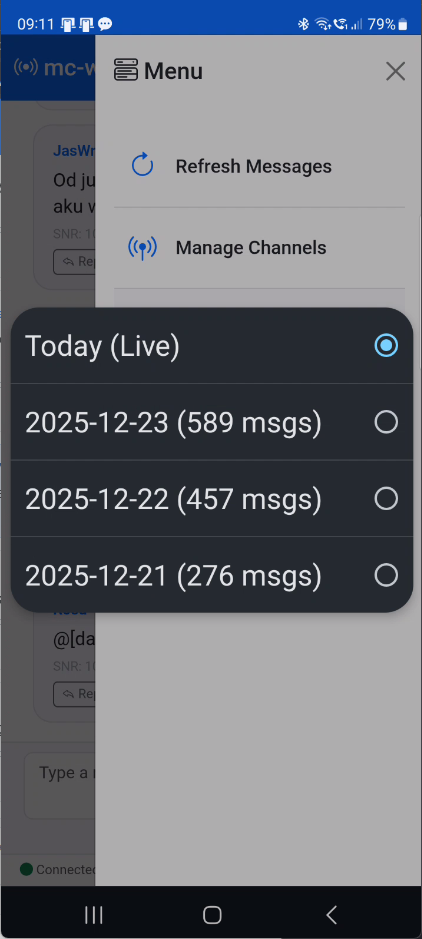
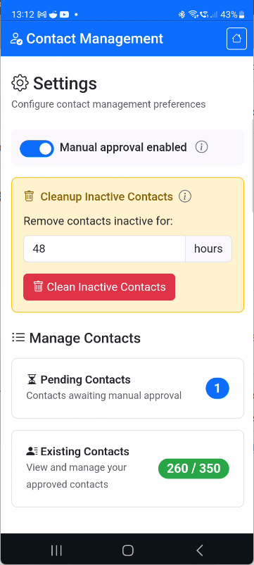
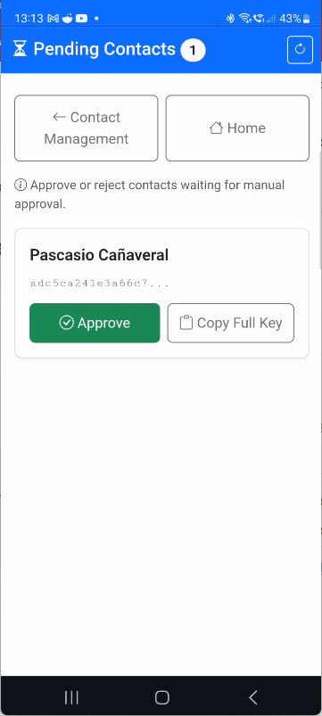
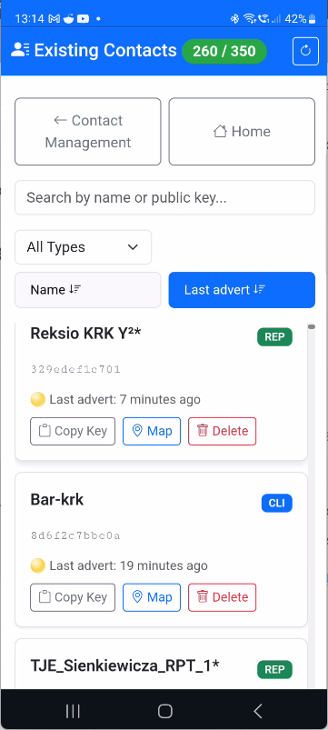

[](LICENSE)
# mc-webui

A lightweight web interface for meshcore-cli, providing browser-based access to MeshCore mesh network.

## Overview

**mc-webui** is a Flask-based web application that wraps `meshcore-cli`, eliminating the need for SSH/terminal access when using MeshCore chat on a LoRa device connected to a Debian VM via BLE or USB. Tested on Heltec V4.

### Key Features

- 📱 **Mobile-first design** - Optimized responsive UI with slide-out menu for small screens
- 💬 **View messages** - Display chat history with intelligent auto-refresh
- 🔔 **Smart notifications** - Bell icon with unread message counter across all channels
- 📊 **Per-channel badges** - Unread count displayed on each channel in selector
- 🔄 **Cross-device sync** - Unread message status syncs across all devices (server-side storage)
- ✉️ **Send messages** - Publish to any channel (140 byte limit for LoRa)
- 💌 **Direct messages (DM)** - Send and receive private messages with delivery status tracking
- 📡 **Channel management** - Create, join, and switch between encrypted channels
- 🔐 **Channel sharing** - Share channels via QR code or encrypted keys
- 🔓 **Public channels** - Join public channels (starting with #) without encryption keys
- 🎯 **Reply to users** - Quick reply with `@[UserName]` format
- 🏷️ **Mention badges** - User mentions displayed as styled badges (like Android Meshcore app)
- 🔗 **Clickable URLs** - Automatic URL detection and link conversion
- 🖼️ **Image previews** - Inline image thumbnails with click-to-expand modal
- 👥 **Contact management** - Manual contact approval mode with pending contacts list (persistent settings)
  - **Dedicated pages:** Separate full-screen views for pending and existing contacts
  - **Advanced sorting:** Sort contacts by name (A-Z/Z-A) or last advertisement time (newest/oldest)
  - **Smart filtering:** Search by name/key, filter by contact type (CLI, REP, ROOM, SENS)
  - **Activity indicators:** Visual status icons (🟢 active, 🟡 recent, 🔴 inactive) based on last advertisement
  - **GPS location:** View contact location on Google Maps (when GPS coordinates available)
  - **Advanced cleanup tool:** Filter and remove contacts by name, type (CLI/REP/ROOM/SENS), and inactivity period with preview before deletion
- 📦 **Message archiving** - Automatic daily archiving with browse-by-date selector
- ⚡ **Efficient polling** - Lightweight update checks every 10s, UI refreshes only when needed
- 📡 **Network commands** - Send advertisement (advert) or flood advertisement (floodadv) for network management

## Tech Stack

- **Backend:** Python 3.11+, Flask
- **Frontend:** HTML5, Bootstrap 5, vanilla JavaScript
- **Deployment:** Docker / Docker Compose (2-container architecture)
- **Communication:** HTTP bridge to meshcore-cli (USB isolation for stability)
- **Data source:** `~/.config/meshcore/<device_name>.msgs` (JSON Lines)

## Quick Start

### Prerequisites

- **Docker** and **Docker Compose** installed ([installation guide](https://wiki.wojtaszek.it/pl/home/apps/docker/installation))
- **Meshcore device** connected via USB (tested on Heltec V4)

**Important Notes:**
- ✅ **No meshcore-cli installation required on host** - meshcore-cli is automatically installed inside the Docker container
- ✅ **No manual directory setup needed** - all data is stored in `./data/` inside the project directory
- ✅ **meshcore-cli version 1.3.12+** is automatically installed for proper Direct Messages (DM) functionality

### Installation

1. **Clone the repository**
   ```bash
   git clone https://github.com/MarekWo/mc-webui
   cd mc-webui
   ```

2. **Configure environment**
   ```bash
   cp .env.example .env
   # Edit .env with your settings
   nano .env
   ```

3. **Find your serial device**
   ```bash
   ls /dev/serial/by-id/
   ```
   You should see a device name starting with `usb-Espressif_Systems_...`. For Heltec V4 it looks like:
   ```
   usb-Espressif_Systems_heltec_wifi_lora_32_v4__16_MB_FLASH__2_MB_PSRAM__90706984A000-if00
   ```
   Copy the **full device ID** and update `MC_SERIAL_PORT` in `.env`:
   ```bash
   MC_SERIAL_PORT=/dev/serial/by-id/usb-Espressif_Systems_heltec_wifi_lora_32_v4__16_MB_FLASH__2_MB_PSRAM__90706984A000-if00
   ```

4. **Build and run**
   ```bash
   docker compose up -d --build
   ```

   **Note:** Docker will automatically create the `./data/` directory with necessary subdirectories (`meshcore/` and `archive/`) on first run. All runtime data (messages, contacts, settings, archives) will be stored there.

5. **Access the web interface**
   Open your browser and navigate to:
   ```
   http://localhost:5000
   ```
   Or from another device on your network:
   ```
   http://<your-server-ip>:5000
   ```

## Configuration

All configuration is done via environment variables in the `.env` file.

**Important:** All data files (messages, contacts, settings, archives) are stored in the `./data/` directory inside your project folder. This directory is automatically created by Docker and should be included in your backups.

### Environment Variables

| Variable | Description | Default |
|----------|-------------|---------|
| `MC_SERIAL_PORT` | Serial device path (use /dev/serial/by-id/ for stability) | `/dev/ttyUSB0` |
| `MC_DEVICE_NAME` | Device name (for .msgs and .adverts.jsonl files) | `MeshCore` |
| `MC_CONFIG_DIR` | Configuration directory (shared between containers) | `./data/meshcore` |
| `MC_ARCHIVE_DIR` | Archive directory path | `./data/archive` |
| `MC_ARCHIVE_ENABLED` | Enable automatic archiving | `true` |
| `MC_ARCHIVE_RETENTION_DAYS` | Days to show in live view | `7` |
| `FLASK_HOST` | Listen address | `0.0.0.0` |
| `FLASK_PORT` | Application port | `5000` |
| `FLASK_DEBUG` | Debug mode | `false` |
| `TZ` | Timezone for container logs | `UTC` |

**Notes:**
- `MC_CONFIG_DIR` is mounted as a shared volume for both containers (meshcore-bridge and mc-webui)
- All paths starting with `./` are relative to the project root directory
- The `data/` directory is excluded from git via `.gitignore`
- Auto-refresh is intelligent: checks for new messages every 10 seconds, updates UI only when needed (no configuration required)

See [.env.example](.env.example) for a complete example.

## Architecture

mc-webui uses a **2-container architecture** for improved USB stability:

1. **meshcore-bridge** - Lightweight service with exclusive USB device access
   - Maintains a **persistent meshcli session** (single long-lived process)
   - Multiplexes stdout: JSON adverts → `.adverts.jsonl` log, CLI commands → HTTP responses
   - Real-time message reception via `msgs_subscribe` (no polling)
   - Thread-safe command queue with event-based synchronization
   - Watchdog thread for automatic crash recovery
   - Exposes HTTP API on port 5001 (internal only)

2. **mc-webui** - Main web application
   - Flask-based web interface
   - Communicates with bridge via HTTP
   - No direct USB access (prevents device locking)

This separation solves USB timeout/deadlock issues common in Docker + VM environments.

### Bridge Session Architecture

The meshcore-bridge maintains a **single persistent meshcli session** instead of spawning new processes per request:

- **Single subprocess.Popen** - One long-lived meshcli process with stdin/stdout pipes
- **Multiplexing** - Intelligently routes output:
  - JSON adverts (with `payload_typename: "ADVERT"`) → logged to `{device_name}.adverts.jsonl`
  - CLI command responses → returned via HTTP API
- **Real-time messages** - `msgs_subscribe` command enables instant message reception without polling
- **Thread-safe queue** - Commands are serialized through a queue.Queue for FIFO execution
- **Timeout-based detection** - Response completion detected when no new lines arrive for 300ms
- **Auto-restart watchdog** - Monitors process health and restarts on crash

This architecture enables advanced features like pending contact management (`manual_add_contacts`) and provides better stability and performance.

## Project Structure

```
mc-webui/
├── Dockerfile                      # Main app Docker image
├── docker-compose.yml              # Multi-container orchestration
├── meshcore-bridge/
│   ├── Dockerfile                  # Bridge service image
│   ├── bridge.py                   # HTTP API wrapper for meshcli
│   └── requirements.txt            # Bridge dependencies (Flask only)
├── app/
│   ├── __init__.py
│   ├── main.py                     # Flask entry point
│   ├── config.py                   # Configuration from env vars
│   ├── meshcore/
│   │   ├── __init__.py
│   │   ├── cli.py                  # HTTP client for bridge API
│   │   └── parser.py               # .msgs file parser
│   ├── routes/
│   │   ├── __init__.py
│   │   ├── api.py                  # REST API endpoints
│   │   └── views.py                # HTML views
│   ├── static/
│   │   ├── css/
│   │   │   └── style.css           # Custom styles
│   │   └── js/
│   │       ├── app.js              # Main page frontend logic
│   │       ├── dm.js               # Direct Messages page logic
│   │       ├── contacts.js         # Contact Management multi-page logic
│   │       └── message-utils.js    # Message content processing (mentions, URLs, images)
│   └── templates/
│       ├── base.html               # Base template
│       ├── index.html              # Main chat view
│       ├── dm.html                 # Direct Messages full-page view
│       ├── contacts_base.html      # Contact pages base template
│       ├── contacts-manage.html    # Contact Management settings & navigation
│       ├── contacts-pending.html   # Pending contacts full-screen view
│       ├── contacts-existing.html  # Existing contacts with sort/filter
│       └── components/             # Reusable components
├── requirements.txt                # Python dependencies
├── .env.example                   # Example environment config
├── .gitignore
└── README.md                      # This file
```

## Development Status

🚀 **Core Features Complete** ✅

### Completed Features

- [x] Environment Setup & Docker Architecture
- [x] Backend Basics (REST API, message parsing, CLI wrapper)
- [x] Frontend Chat View (Bootstrap UI, message display)
- [x] Message Sending (Send form, reply functionality)
- [x] Intelligent Auto-refresh (10s checks, UI updates only when needed)
- [x] Contact Management (Cleanup modal with configurable threshold)
- [x] Channel Management (Create, join, share via QR, delete with auto-cleanup)
- [x] Public Channels (# prefix support, auto-key generation)
- [x] Message Archiving (Daily archiving with browse-by-date selector)
- [x] Smart Notifications (Unread counters per channel and total)
- [x] Direct Messages (DM) - Private messaging with delivery status tracking
- [x] Advanced Contact Management - Multi-page interface with sorting, filtering, and activity tracking
- [x] Message Content Enhancements - Mention badges, clickable URLs, and image previews

### Next Steps

- [ ] Performance Optimization - Frontend and backend improvements
- [ ] Enhanced Testing - Unit and integration tests
- [ ] Documentation Polish - API docs and usage guides

## Usage

### Viewing Messages

The main page displays chat history from the currently selected channel. The app uses an intelligent refresh system that checks for new messages every 10 seconds and updates the UI only when new messages actually arrive.

**Unread notifications:**
- **Bell icon** in navbar shows total unread count across all channels
- **Channel badges** display unread count per channel (e.g., "Malopolska (3)")
- Messages are automatically marked as read when you view them
- Read status persists across browser sessions

By default, the live view shows messages from the last 7 days. Older messages are automatically archived and can be accessed via the date selector.

### Managing Channels

Access channel management:
1. Click the menu icon (☰) in the navbar
2. Select "Manage Channels" from the slide-out menu

#### Creating a New Channel
1. Click "Add New Channel"
2. Enter a channel name (letters, numbers, _ and - only)
3. Click "Create & Auto-generate Key"
4. The channel is created with a secure encryption key

#### Sharing a Channel
1. In the Channels modal, click the share icon next to any channel
2. Share the QR code (scan with another device) or copy the encryption key
3. Others can join using the "Join Existing" option

#### Joining a Channel

**For private channels:**
1. Click "Join Existing"
2. Enter the channel name and encryption key (received from channel creator)
3. Click "Join Channel"
4. The channel will be added to your available channels

**For public channels (starting with #):**
1. Click "Join Existing"
2. Enter the channel name (e.g., `#test`, `#krakow`)
3. Leave the encryption key field empty (key is auto-generated based on channel name)
4. Click "Join Channel"
5. You can now chat with other users on the same public channel

#### Deleting a Channel
1. In the Channels modal, click the delete icon (trash) next to any channel
2. Confirm the deletion
3. The channel configuration and **all its messages** will be permanently removed

**Note:** Deleting a channel removes all message history for that channel from your device to prevent data leakage when reusing channel slots.

#### Switching Channels
Use the channel selector dropdown in the navbar to switch between channels. Your selection is remembered between sessions.

### Viewing Message Archives

Access historical messages using the date selector:

1. Click the menu icon (☰) in the navbar
2. Under "Message History" select a date to view archived messages for that day
3. Select "Today (Live)" to return to live view

Archives are created automatically at midnight (00:00 UTC) each day. The live view always shows the most recent messages (last 7 days by default).

### Sending Messages

1. Select your target channel using the channel selector
2. Type your message in the text field at the bottom
3. Press Enter or click "Send"
4. Your message will be published to the selected channel

### Replying to Users

Click the reply button on any message to insert `@[UserName]` into the text field, then type your reply.

### Message Content Features

The application automatically enhances message content with interactive elements:

#### Mention Badges
User mentions in the format `@[Username]` are displayed as styled blue badges (similar to the Android Meshcore app), making it easier to identify who is being addressed in a conversation.

**Example:** `@[MarWoj] test w Kielcach` displays with "MarWoj" as a blue badge.

#### Clickable URLs
URLs starting with `http://` or `https://` are automatically converted to clickable links that open in a new browser tab.

**Example:** `https://example.com` becomes a clickable blue link.

#### Image Previews
URLs ending in `.jpg`, `.jpeg`, `.png`, `.gif`, or `.webp` are displayed as:
- **Inline thumbnails** (max 300x200px on desktop, 200x150px on mobile)
- **Click-to-expand** - Click any thumbnail to view the full-size image in a modal preview
- **Lazy loading** - Images load only when needed for better performance
- **Error handling** - Broken images show a placeholder

**Example:** Sending `https://example.com/photo.jpg` shows a thumbnail of the image that can be clicked to view full-size.

**Note:** All content enhancements work in both channel messages and Direct Messages (DM).

### Direct Messages (DM)

Access the Direct Messages feature:

**From the menu:**
1. Click the menu icon (☰) in the navbar
2. Select "Direct Messages" from the menu
3. Opens a dedicated full-page DM view

**Using the DM page:**
1. **Select a recipient** from the dropdown at the top:
   - **Existing conversations** are shown first (with message history)
   - Separator: "--- Available contacts ---"
   - **All client contacts** from your device (only CLI type, no repeaters/rooms)
   - You can start a new conversation with anyone in your contacts list
2. Type your message in the input field (max 140 bytes, same as channels)
3. Use the emoji picker button to insert emojis
4. Press Enter or click Send
5. Click "Back" button to return to the main chat view

**Note:** Only client contacts (CLI) are shown in the dropdown. Repeaters (REP), rooms (ROOM), and sensors (SENS) are automatically filtered out.

**Message status indicators:**
- ⏳ **Pending** (clock icon, yellow) - Message sent, awaiting delivery confirmation
- Note: Due to meshcore-cli limitations, we cannot track actual delivery status

**Notifications:**
- The bell icon shows a secondary green badge for unread DMs
- Each conversation shows unread indicator (*) in the dropdown
- DM badge in the menu shows total unread DM count

### Contact Management

Access the Contact Management feature to control who can connect to your node:

**From the menu:**
1. Click the menu icon (☰) in the navbar
2. Select "Contact Management" from the menu
3. Opens the contact management page

#### Manual Contact Approval

By default, new contacts attempting to connect are automatically added to your contacts list. You can enable manual approval to control who can communicate with your node.

**Enable manual approval:**
1. On the Contact Management page, toggle the "Manual Contact Approval" switch
2. When enabled, new contact requests will appear in the Pending Contacts list
3. This setting persists across container restarts

**Security benefits:**
- **Control over network access** - Only approved contacts can communicate with your node
- **Prevention of spam/unwanted contacts** - Filter out random nodes attempting connection
- **Explicit trust model** - You decide who to trust on the mesh network

#### Pending Contacts

When manual approval is enabled, new contacts appear in the Pending Contacts list for review:

**Approve a contact:**
1. View the contact name and truncated public key
2. Click "Copy Full Key" to copy the complete public key (useful for verification)
3. Click "Approve" to add the contact to your contacts list
4. The contact is moved from pending to regular contacts

**Note:** Always use the full public key for approval (not name or prefix). This ensures compatibility with all contact types (CLI, ROOM, REP, SENS).

**Refresh pending list:**
- Click the "Refresh" button to check for new pending contacts
- The page automatically loads pending contacts when first opened

#### Existing Contacts

The Existing Contacts section displays all contacts currently stored on your device (CLI, REP, ROOM, SENS types).

**Features:**
- **Counter badge** - Shows current contact count vs. 350 limit (MeshCore device max)
  - Green: Normal (< 300 contacts)
  - Yellow: Warning (300-339 contacts)
  - Red (pulsing): Alarm (≥ 340 contacts)
- **Search** - Filter contacts by name or public key prefix
- **Type filter** - Show only specific contact types (All / CLI / REP / ROOM / SENS)
- **Contact cards** - Display name, type badge, public key prefix, path info, and last seen timestamp
- **Last Seen** - Shows when each contact was last active with activity indicators:
  - 🟢 **Active** (seen < 5 minutes ago)
  - 🟡 **Recent** (seen < 1 hour ago)
  - 🔴 **Inactive** (seen > 1 hour ago)
  - ⚫ **Unknown** (no timestamp available)
  - Relative time format: "5 minutes ago", "2 hours ago", "3 days ago", etc.

**Managing contacts:**
1. **Search contacts:**
   - Type in the search box to filter by name or public key prefix
   - Results update instantly as you type

2. **Filter by type:**
   - Use the type dropdown to show only:
     - **CLI** - Client devices (blue badge)
     - **REP** - Repeaters (green badge)
     - **ROOM** - Room servers (cyan badge)
     - **SENS** - Sensors (yellow badge)

3. **Copy public key:**
   - Click "Copy Key" button to copy the public key prefix to clipboard
   - Useful for sharing or verification

4. **Delete a contact:**
   - Click the "Delete" button (red trash icon)
   - Confirm deletion in the modal dialog
   - Contact is permanently removed from device
   - **Warning:** This action cannot be undone

**Refresh contacts list:**
- Click the "Refresh" button to reload the contacts list
- The page automatically loads contacts when first opened

**Monitoring contact capacity:**
- MeshCore devices have a limit of 350 contacts
- The counter badge changes color as you approach the limit:
  - **0-299**: Green (plenty of space)
  - **300-339**: Yellow warning (nearing limit)
  - **340-350**: Red alarm (critical - delete some contacts soon)

#### Debugging

If you encounter issues with contact management:

**Check logs:**
```bash
# mc-webui container logs
docker compose logs -f mc-webui

# meshcore-bridge container logs (where settings are applied)
docker compose logs -f meshcore-bridge
```

**Look for:**
- "Loaded webui settings" - confirms settings file is being read
- "manual_add_contacts set to on/off" - confirms setting is applied to meshcli session
- "Saved manual_add_contacts=..." - confirms setting is persisted to file

### Managing Contacts (Cleanup)

The advanced cleanup tool allows you to filter and remove contacts based on multiple criteria:

1. Navigate to **Contact Management** page (from slide-out menu)
2. Scroll to **Cleanup Contacts** section (below Existing Contacts)
3. Configure filters:
   - **Name Filter:** Enter partial contact name to search (optional)
   - **Advanced Filters** (collapsible):
     - **Contact Types:** Select which types to include (CLI, REP, ROOM, SENS)
     - **Date Field:** Choose between "Last Advert" (recommended) or "Last Modified"
     - **Days of Inactivity:** Contacts inactive for more than X days (0 = ignore)
4. Click **Preview Cleanup** to see matching contacts
5. Review the list and confirm deletion

**Example use cases:**
- Remove all REP contacts inactive for 30+ days: Select REP, set days to 30
- Clean specific contact names: Enter partial name (e.g., "test")

### Network Commands

Access network commands from the slide-out menu under "Network Commands" section:

#### Send Advert (Recommended)
Sends a single advertisement frame to announce your node's presence in the mesh network. This is the normal, energy-efficient way to advertise.

1. Click the menu icon (☰) in the navbar
2. Click "Send Advert" under Network Commands
3. Wait for confirmation toast

#### Flood Advert (Use Sparingly!)
Sends advertisement in flooding mode, forcing all nodes to retransmit. **Use only when:**
- Starting a completely new network
- After device reset or firmware change
- When routing is broken and node is not visible
- For debugging/testing purposes

⚠️ **Warning:** Flood advertisement causes high airtime usage and can destabilize larger LoRa networks. A confirmation dialog will appear before execution.

1. Click the menu icon (☰) in the navbar
2. Click "Flood Advert" (highlighted in warning color)
3. Confirm you want to proceed
4. Wait for confirmation toast

## Docker Commands

```bash
# Start the application
docker compose up -d

# View logs
docker compose logs -f

# Stop the application
docker compose down

# Rebuild after code changes
docker compose up -d --build

# Check container status
docker compose ps
```

## Testing Bridge API

The `meshcore-bridge` container exposes HTTP endpoints for pending contact management.

### Test Pending Contacts Endpoints

```bash
# List pending contacts (from inside mc-webui container or server)
curl -s http://meshcore-bridge:5001/pending_contacts | jq

# Add a pending contact
curl -s -X POST http://meshcore-bridge:5001/add_pending \
  -H 'Content-Type: application/json' \
  -d '{"selector":"Skyllancer"}' | jq

# Example response for GET /pending_contacts:
# {
#   "success": true,
#   "pending": [
#     {
#       "name": "Skyllancer",
#       "public_key": "f9ef..."
#     },
#     {
#       "name": "KRA Reksio mob2🐕",
#       "public_key": "41d5..."
#     }
#   ],
#   "raw_stdout": "Skyllancer: f9ef...\nKRA Reksio mob2🐕: 41d5..."
# }

# Example response for POST /add_pending:
# {
#   "success": true,
#   "stdout": "Contact added successfully",
#   "stderr": "",
#   "returncode": 0
# }
```

**Note:** These endpoints require `manual_add_contacts` mode to be enabled in meshcli:
```bash
# Enable manual contact approval (run in meshcli interactive mode)
set manual_add_contacts on
```

## Troubleshooting

### Device not found
```bash
# Check if device is connected
ls -l /dev/serial/by-id/

# Verify device permissions
sudo chmod 666 /dev/serial/by-id/usb-Espressif*
```

### Container won't start
```bash
# Check logs for both services
docker compose logs meshcore-bridge
docker compose logs mc-webui

# Verify .env file exists
ls -la .env

# Check if ports are available
sudo netstat -tulpn | grep -E '5000|5001'
```

### USB Communication Issues
The 2-container architecture resolves common USB timeout/deadlock problems:
- **meshcore-bridge** has exclusive USB access
- **mc-webui** uses HTTP (no direct device access)
- Restarting `mc-webui` **does not** affect USB connection
- If bridge has USB issues, restart only that service:
  ```bash
  docker compose restart meshcore-bridge
  ```

### Bridge connection errors
```bash
# Check bridge health
docker compose exec mc-webui curl http://meshcore-bridge:5001/health

# Bridge logs
docker compose logs -f meshcore-bridge

# Test meshcli directly in bridge container
docker compose exec meshcore-bridge meshcli -s /dev/ttyUSB0 infos
```

### Messages not updating
- Check that `.msgs` file exists in `MC_CONFIG_DIR`
- Verify bridge service is healthy: `docker compose ps`
- Check bridge logs for command errors

## Gallery

       

## Security Notes

⚠️ **Important**: This application is designed for **trusted local networks only** and has **no authentication**. Do not expose it to the internet without implementing proper security measures.

## Contributing

This is an open-source project. Contributions are welcome!

- All code, comments, and documentation must be in English
- Follow the existing code style
- Test your changes with real hardware if possible

## License

[](LICENSE)

## References

- [MeshCore Documentation](https://meshcore.org)
- [meshcore-cli GitHub](https://github.com/meshcore-dev/meshcore-cli)

## Contact

