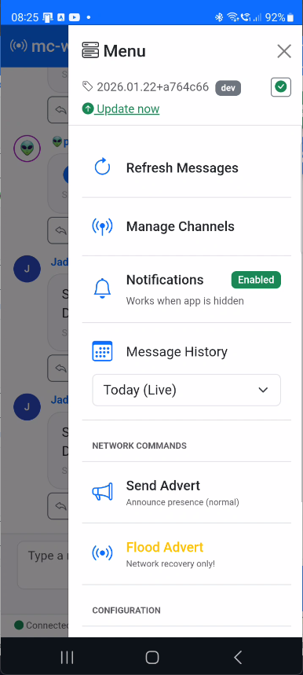
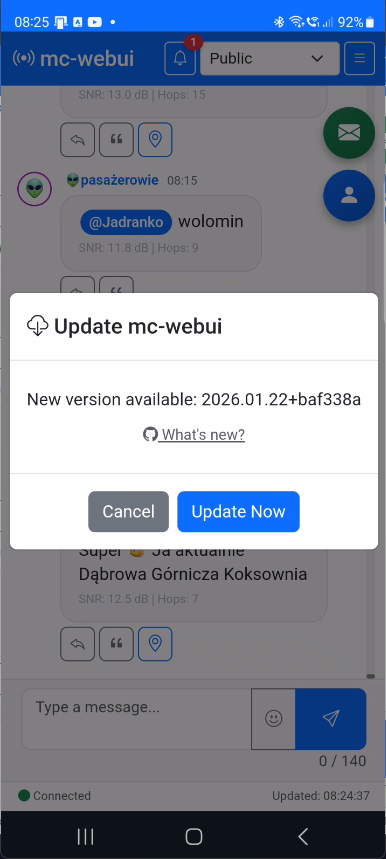
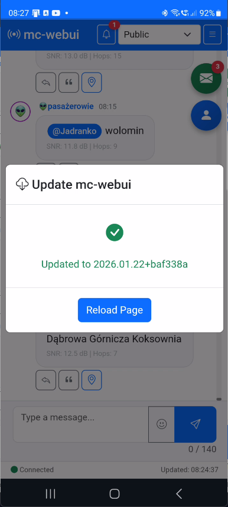

[](LICENSE)
# mc-webui

A lightweight web interface for meshcore-cli, providing browser-based access to MeshCore mesh network.

[](https://deepwiki.com/MarekWo/mc-webui)

## Overview

**mc-webui** is a Flask-based web application that wraps `meshcore-cli`, eliminating the need for SSH/terminal access when using MeshCore chat on a LoRa device connected to a Debian VM via BLE or USB. Tested on Heltec V3 and Heltec V4.


## Key Features

- **Mobile-first design** - Responsive UI optimized for small screens
- **Channel management** - Create, join, share (QR code), and switch between encrypted channels
- **Direct Messages (DM)** - Private messaging with delivery status tracking
- **Smart notifications** - Unread message counters per channel with cross-device sync
- **Contact management** - Manual approval mode, filtering, protection, cleanup tools
- **Contact map** - View contacts with GPS coordinates on OpenStreetMap (Leaflet)
- **Message archives** - Automatic daily archiving with browse-by-date selector
- **Interactive Console** - Direct meshcli command execution via WebSocket
- **@Mentions autocomplete** - Type @ to see contact suggestions with fuzzy search
- **PWA support** - Browser notifications and installable app (experimental)
- **Full offline support** - Works without internet (local Bootstrap, icons, emoji picker)

For detailed feature documentation, see the [User Guide](docs/user-guide.md).

## Quick Start

### Prerequisites

**1. Meshcore Device (tested on Heltec V4)**
- Flash the device at [https://flasher.meshcore.co.uk/](https://flasher.meshcore.co.uk/). Choose the `Companion USB` role.
- Configure the device with the Meshcore mobile app (from Google Play Store / App Store): Name, Location (optional), Preset

**2. Linux Server**
- Git installed
- Docker and Docker Compose installed ([installation guide](docs/docker-install.md))

**Important Notes:**
- No meshcore-cli installation required on host - automatically installed inside Docker container
- No manual directory setup needed - all data stored in `./data/` inside the project directory
- meshcore-cli version 1.3.12+ is automatically installed for proper DM functionality

---

### Installation

1. **Clone the repository**
    ```bash
    cd ~
    git clone https://github.com/MarekWo/mc-webui
    cd mc-webui
    ```

2. **Create configuration file**
    ```bash
    cp .env.example .env
    ```

    **In most cases, no changes are needed!** The defaults work automatically:
    - `MC_SERIAL_PORT=auto` - auto-detects your USB device
    - `MC_DEVICE_NAME=auto` - auto-detects device name from meshcli

    Optionally edit `.env` to set your timezone: `TZ=Europe/Warsaw`

    <details>
    <summary><b>Troubleshooting: Multiple USB devices or detection fails</b></summary>

    Check available serial devices:
    ```bash
    ls /dev/serial/by-id/
    ```

    If you see multiple devices, edit `.env` and set `MC_SERIAL_PORT` explicitly:
    ```bash
    MC_SERIAL_PORT=/dev/serial/by-id/usb-Espressif_Systems_heltec_...
    ```

    </details>

3. **Verify Serial Device Permissions** (if needed)
    ```bash
    sudo usermod -aG dialout $USER
    # Log out and log back in for changes to take effect
    ```

4. **Build and run**
    ```bash
    python3 -m app.version freeze
    docker compose up -d --build
    ```

    This will:
    - Download base images (Python, Alpine Linux)
    - Install meshcore-cli inside containers
    - Create `./data/` directory structure automatically
    - Start both containers (meshcore-bridge and mc-webui)

5. **Verify installation**
    ```bash
    docker compose ps
    ```

    Both containers should show `Up` status. Check logs if needed:
    ```bash
    docker compose logs -f
    ```

6. **Access the web interface**

   Open your browser and navigate to:
   ```
   http://<your-server-ip>:5000
   ```

   To find your server IP: `hostname -I | awk '{print $1}'`

7. **Initial Configuration (In Web UI)**
    - Main page loads with chat interface on "Public" channel
    - Wait for initial sync (1-2 minutes)
    - Optional: Enable manual contact approval in Contact Management

---

## Basic Usage

1. **View messages** - Main page shows chat history with auto-refresh every 10 seconds
2. **Send messages** - Type in the text field and press Enter (135 bytes for channels, 150 bytes for DM)
3. **Switch channels** - Use the dropdown in navbar
4. **Direct Messages** - Access via menu (☰) → "Direct Messages"
5. **Manage contacts** - Access via menu (☰) → "Contact Management"
6. **Console** - Access via menu (☰) → "Console" for direct meshcli commands

For complete usage instructions, see the [User Guide](docs/user-guide.md).

---

## Updating

### Using the update script (recommended)

The easiest way to update mc-webui:

```bash
cd ~/mc-webui
./scripts/update.sh
```

The script automatically pulls changes, freezes the version, and rebuilds containers.

**Optional: Create a global alias for quick updates**

Add to your `~/.bashrc` or `~/.zshrc`:

```bash
alias mcupdate='~/mc-webui/scripts/update.sh'
```

Then reload your shell (`source ~/.bashrc`) and update anytime with:

```bash
mcupdate
```

### Manual update

If you prefer to run commands manually:

```bash
cd ~/mc-webui
git pull
python3 -m app.version freeze
docker compose up -d --build
```

The `python3 -m app.version freeze` command captures the current Git version (date + commit hash) for display in the app menu.

### Testing experimental features

The `dev` branch contains new features that are still being tested:

```bash
cd ~/mc-webui
git checkout dev
./scripts/update.sh
```

To return to the stable version:

```bash
cd ~/mc-webui
git checkout main
./scripts/update.sh
```

### Remote updates from web GUI (optional)

You can enable one-click updates directly from the mc-webui menu. This requires installing a small webhook service on the host machine.

**Install the updater service:**

```bash
cd ~/mc-webui
sudo ./scripts/updater/install.sh
```

The installer will:
- Create a systemd service `mc-webui-updater`
- Start a webhook server on port 5050 (localhost only)
- Enable automatic startup on boot

**Usage:**
1. Click the refresh button (↻) next to the version in the menu
2. If an update is available, an "Update" button appears
3. Click "Update" to trigger the update remotely
4. The app will automatically reload when the update completes

**Useful commands:**

```bash
# Check service status
systemctl status mc-webui-updater

# View logs
journalctl -u mc-webui-updater -f

# Uninstall
sudo ~/mc-webui/scripts/updater/install.sh --uninstall
```

**Security note:** The webhook listens only on localhost. The Docker container connects to it via the Docker bridge network.

---

## Gallery

<table>
  <tr>
    <td align="center"><a href="gallery/main_window.png"><br>Main Window</a></td>
    <td align="center"><a href="gallery/dm.png"><br>Direct Messages</a></td>
    <td align="center"><a href="gallery/unread_msgs.png"><br>Unread Messages</a></td>
    <td align="center"><a href="gallery/msg_archive.png"><br>Message Archive</a></td>
  </tr>
  <tr>
    <td align="center"><a href="gallery/menu_1.png"><br>Menu (1)</a></td>
    <td align="center"><a href="gallery/menu_2.png"><br>Menu (2)</a></td>
    <td align="center"><a href="gallery/device_info.png"><br>Device Info</a></td>
    <td align="center"><a href="gallery/update_check.png"><br>Update Check</a></td>
  </tr>
  <tr>
    <td align="center"><a href="gallery/update_available.png"><br>Update Available</a></td>
    <td align="center"><a href="gallery/remote_update.png"><br>Remote Update</a></td>
    <td align="center"><a href="gallery/updated_successfully.png"><br>Updated Successfully</a></td>
    <td align="center"><a href="gallery/meshcli_console.png"><br>Meshcli Console</a></td>
  </tr>
  <tr>
    <td align="center"><a href="gallery/contact_management.png"><br>Contact Management</a></td>
    <td align="center"><a href="gallery/existing_contacts.png"><br>Existing Contacts</a></td>
    <td align="center"><a href="gallery/approve_contact.png"><br>Approve Contact</a></td>
    <td align="center"><a href="gallery/channel_management.png"><br>Channel Management</a></td>
  </tr>
  <tr>
    <td align="center"><a href="gallery/map.png"><br>Map</a></td>
    <td align="center"><a href="gallery/map_individual.png"><br>Map (Individual)</a></td>
    <td align="center"><a href="gallery/image_preview_1.png"><br>Image Preview (1)</a></td>
    <td align="center"><a href="gallery/image_preview_2.png"><br>Image Preview (2)</a></td>
  </tr>
</table>

---

## Documentation

| Document | Description |
|----------|-------------|
| [User Guide](docs/user-guide.md) | Complete feature documentation |
| [Architecture](docs/architecture.md) | Technical details, API reference |
| [Troubleshooting](docs/troubleshooting.md) | Common issues and solutions |
| [Docker Installation](docs/docker-install.md) | How to install Docker on Debian/Ubuntu |

---

## Development Status

### Completed Features

- [x] Environment Setup & Docker Architecture
- [x] Backend Basics (REST API, message parsing, CLI wrapper)
- [x] Frontend Chat View (Bootstrap UI, message display)
- [x] Message Sending (Send form, reply functionality)
- [x] Intelligent Auto-refresh (10s checks, UI updates only when needed)
- [x] Contact Management (Cleanup modal with configurable threshold)
- [x] Channel Management (Create, join, share via QR, delete with auto-cleanup)
- [x] Public Channels (# prefix support, auto-key generation)
- [x] Message Archiving (Daily archiving with browse-by-date selector)
- [x] Smart Notifications (Unread counters per channel and total)
- [x] Direct Messages (DM) - Private messaging with delivery status tracking
- [x] Advanced Contact Management - Multi-page interface with sorting, filtering
- [x] Message Content Enhancements - Mention badges, clickable URLs, image previews
- [x] @Mentions Autocomplete - Type @ to get contact suggestions with fuzzy search
- [x] PWA Notifications (Experimental) - Browser notifications and app badge counters
- [x] Full Offline Support - Local Bootstrap libraries and Service Worker caching
- [x] Interactive Console - Direct meshcli access via WebSocket with command history
- [x] Contact Map - View contacts with GPS coordinates on OpenStreetMap (Leaflet)

### Next Steps

- [ ] Performance Optimization - Frontend and backend improvements
- [ ] Enhanced Testing - Unit and integration tests
- [ ] Documentation Polish - API docs and usage guides

---

## Security Notes

**Important**: This application is designed for **trusted local networks only** and has **no authentication**. Do not expose it to the internet without implementing proper security measures.

---

## Contributing

This is an open-source project. Contributions are welcome!

- All code, comments, and documentation must be in English
- Follow the existing code style
- Test your changes with real hardware if possible

---

## License

[](LICENSE)

---

## References

- [MeshCore Documentation](https://meshcore.org)
- [meshcore-cli GitHub](https://github.com/meshcore-dev/meshcore-cli)

---

## Buy me a coffee

If you appreciate what I am doing you can [buy me a coffee](https://buycoffee.to/marwoj) :)


Thanks!

## Contact


