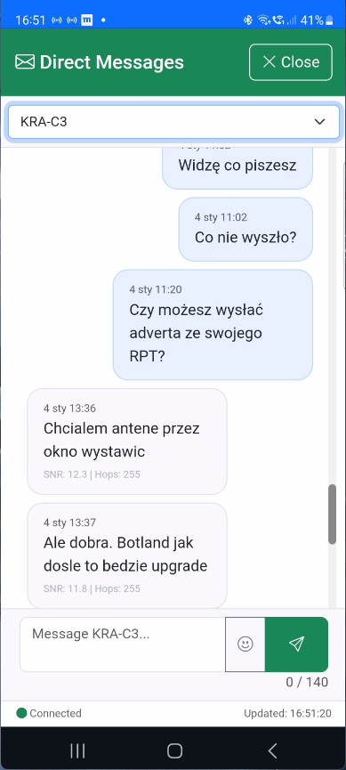

[](LICENSE)
# mc-webui

A lightweight web interface for meshcore-cli, providing browser-based access to MeshCore mesh network.

## Overview

**mc-webui** is a Flask-based web application that wraps `meshcore-cli`, eliminating the need for SSH/terminal access when using MeshCore chat on a LoRa device connected to a Debian VM via BLE or USB. Tested on Heltec V4.


## Key Features

- **Mobile-first design** - Responsive UI optimized for small screens
- **Channel management** - Create, join, share (QR code), and switch between encrypted channels
- **Direct Messages (DM)** - Private messaging with delivery status tracking
- **Smart notifications** - Unread message counters per channel with cross-device sync
- **Contact management** - Manual approval mode, filtering, cleanup tools
- **Message archives** - Automatic daily archiving with browse-by-date selector
- **PWA support** - Browser notifications and installable app (experimental)
- **Full offline support** - Works without internet (local Bootstrap, icons, emoji picker)

For detailed feature documentation, see the [User Guide](docs/user-guide.md).

## Quick Start

### Prerequisites

**1. Meshcore Device (tested on Heltec V4)**
- Flash the device at [https://flasher.meshcore.co.uk/](https://flasher.meshcore.co.uk/). Choose the `Companion USB` role.
- Configure the device with the Meshcore mobile app (from Google Play Store / App Store): Name, Location (optional), Preset

**2. Linux Server**
- Git installed
- Docker and Docker Compose installed ([installation guide](docs/docker-install.md))

**Important Notes:**
- No meshcore-cli installation required on host - automatically installed inside Docker container
- No manual directory setup needed - all data stored in `./data/` inside the project directory
- meshcore-cli version 1.3.12+ is automatically installed for proper DM functionality

---

### Installation

1. **Clone the repository**
    ```bash
    cd ~
    git clone https://github.com/MarekWo/mc-webui
    cd mc-webui
    ```

2. **Find your serial device ID**
   ```bash
   ls /dev/serial/by-id/
   ```
   You should see a device name starting with `usb-...`. For Heltec V4 may look like:
   ```
   usb-Espressif_Systems_heltec_wifi_lora_32_v4__16_MB_FLASH__2_MB_PSRAM__90706984A000-if00
   ```
   **Copy the full device ID** - you'll need it in the next step.

3. **Configure your environment**
    ```bash
    cp .env.example .env
    nano .env
    ```

    **Required changes in .env:**
    - `MC_SERIAL_PORT=/dev/serial/by-id/<your-device-id>`
    - `MC_DEVICE_NAME=<your-device-name>`
    - `TZ=Europe/Warsaw` (optional, set your timezone)

    **Leave these as default:**
    ```bash
    MC_CONFIG_DIR=./data/meshcore
    MC_ARCHIVE_DIR=./data/archive
    ```

4. **Verify Serial Device Permissions**
    ```bash
    ls -l /dev/serial/by-id/usb-*
    ```

    If needed, add your user to dialout group:
    ```bash
    sudo usermod -aG dialout $USER
    # Log out and log back in for changes to take effect
    ```

5. **Build and run**
    ```bash
    docker compose up -d --build
    ```

    This will:
    - Download base images (Python, Alpine Linux)
    - Install meshcore-cli inside containers
    - Create `./data/` directory structure automatically
    - Start both containers (meshcore-bridge and mc-webui)

6. **Verify installation**
    ```bash
    docker compose ps
    ```

    Both containers should show `Up` status. Check logs if needed:
    ```bash
    docker compose logs -f
    ```

7. **Access the web interface**

   Open your browser and navigate to:
   ```
   http://<your-server-ip>:5000
   ```

   To find your server IP: `hostname -I | awk '{print $1}'`

8. **Initial Configuration (In Web UI)**
    - Main page loads with chat interface on "Public" channel
    - Wait for initial sync (1-2 minutes)
    - Optional: Enable manual contact approval in Contact Management

---

## Basic Usage

1. **View messages** - Main page shows chat history with auto-refresh every 10 seconds
2. **Send messages** - Type in the text field and press Enter (140 byte limit)
3. **Switch channels** - Use the dropdown in navbar
4. **Direct Messages** - Access via menu (☰) → "Direct Messages"
5. **Manage contacts** - Access via menu (☰) → "Contact Management"

For complete usage instructions, see the [User Guide](docs/user-guide.md).

---

## Gallery

        

---

## Documentation

| Document | Description |
|----------|-------------|
| [User Guide](docs/user-guide.md) | Complete feature documentation |
| [Architecture](docs/architecture.md) | Technical details, API reference |
| [Troubleshooting](docs/troubleshooting.md) | Common issues and solutions |
| [Docker Installation](docs/docker-install.md) | How to install Docker on Debian/Ubuntu |

---

## Development Status

### Completed Features

- [x] Environment Setup & Docker Architecture
- [x] Backend Basics (REST API, message parsing, CLI wrapper)
- [x] Frontend Chat View (Bootstrap UI, message display)
- [x] Message Sending (Send form, reply functionality)
- [x] Intelligent Auto-refresh (10s checks, UI updates only when needed)
- [x] Contact Management (Cleanup modal with configurable threshold)
- [x] Channel Management (Create, join, share via QR, delete with auto-cleanup)
- [x] Public Channels (# prefix support, auto-key generation)
- [x] Message Archiving (Daily archiving with browse-by-date selector)
- [x] Smart Notifications (Unread counters per channel and total)
- [x] Direct Messages (DM) - Private messaging with delivery status tracking
- [x] Advanced Contact Management - Multi-page interface with sorting, filtering
- [x] Message Content Enhancements - Mention badges, clickable URLs, image previews
- [x] PWA Notifications (Experimental) - Browser notifications and app badge counters
- [x] Full Offline Support - Local Bootstrap libraries and Service Worker caching

### Next Steps

- [ ] Performance Optimization - Frontend and backend improvements
- [ ] Enhanced Testing - Unit and integration tests
- [ ] Documentation Polish - API docs and usage guides

---

## Security Notes

**Important**: This application is designed for **trusted local networks only** and has **no authentication**. Do not expose it to the internet without implementing proper security measures.

---

## Contributing

This is an open-source project. Contributions are welcome!

- All code, comments, and documentation must be in English
- Follow the existing code style
- Test your changes with real hardware if possible

---

## License

[](LICENSE)

---

## References

- [MeshCore Documentation](https://meshcore.org)
- [meshcore-cli GitHub](https://github.com/meshcore-dev/meshcore-cli)

---

## Contact


