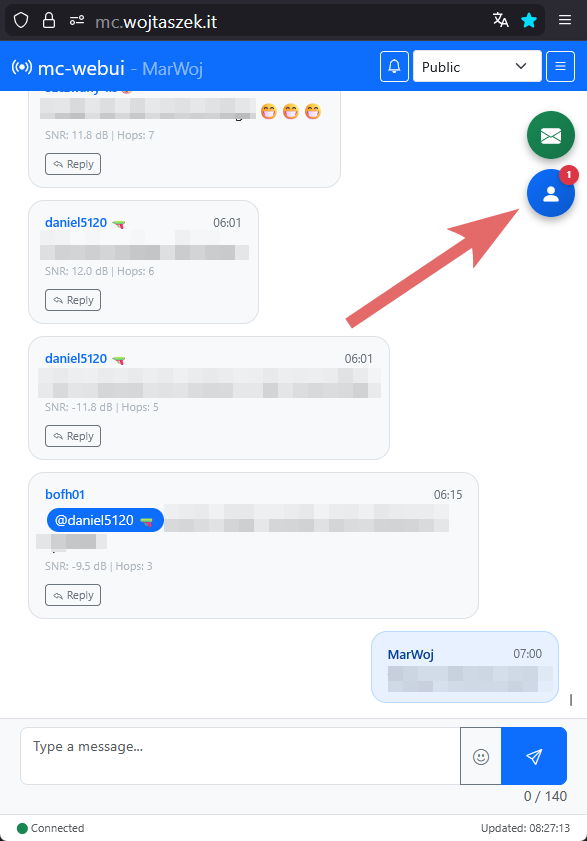
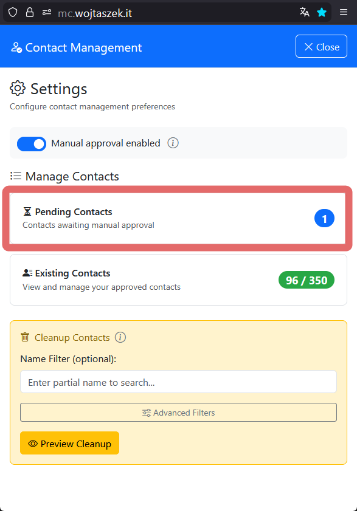
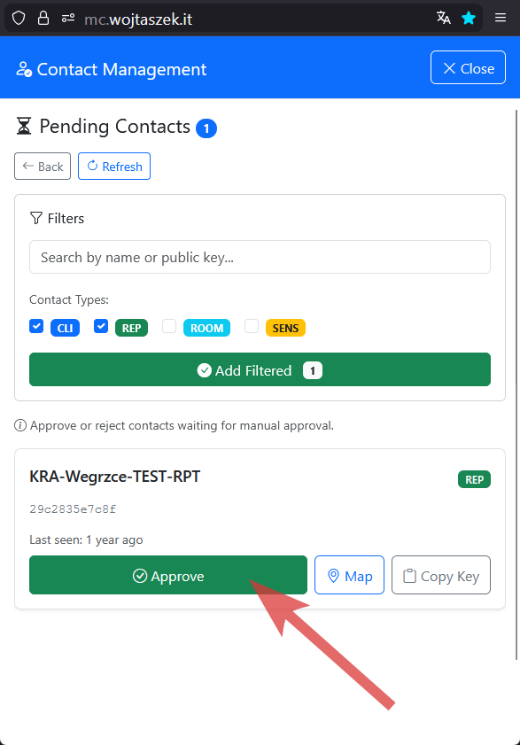
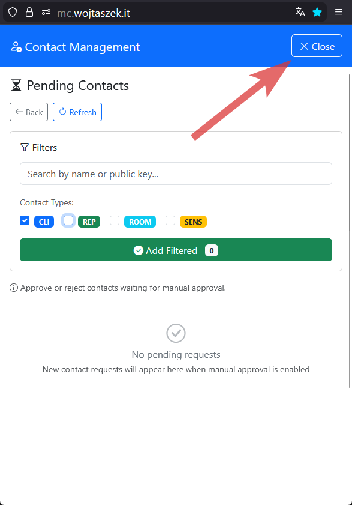
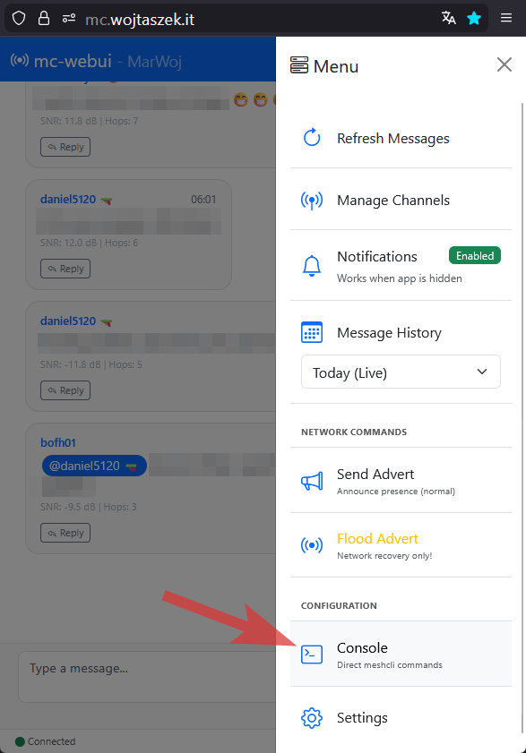
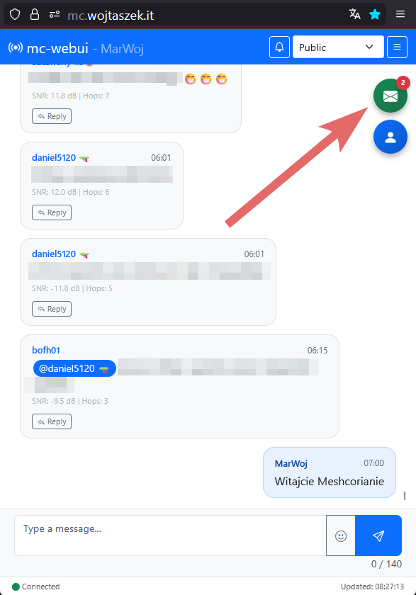
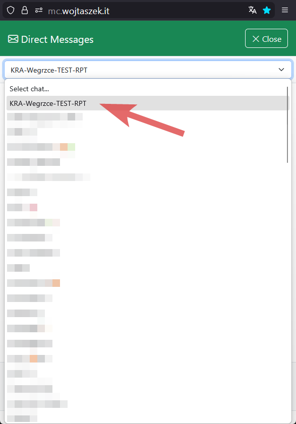
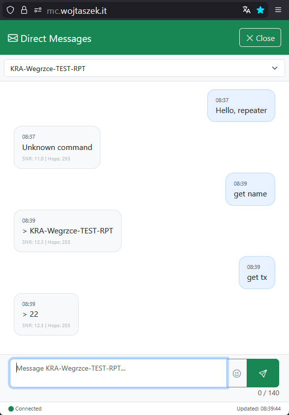

# How to Manage Your Repeater

This guide explains how to manage a MeshCore repeater device directly from the mc-webui interface using Direct Messages.

---

## 1. Add Your Repeater to Contacts

- Wait for your repeater's first `advert`
- Click on the Contacts icon

    

- Go to `Pending contacts` panel

    

- Search for your repeater on the list and approve it

    

- Reset your search filter (it is recommended to leave CLI selected only) and return to the main chat view

    

---

## 2. Login to Your Repeater and Initialize Conversation

- Open the `meshcli Console`

    

- Enter the `login <REPEATER_NAME> <password>` command
- Type the `msg <REPEATER_NAME> "Hello"` command (you can use any message text)

    

- Return to the main chat view

---

## 3. Send Commands to Your Repeater

- From the main chat view, click on the DM icon

    

- Find your repeater's name on the list

    

- Start sending commands to your repeater as if it were a regular DM conversation

    

For full commands reference, see [Repeater & Room Server CLI Reference](https://github.com/meshcore-dev/MeshCore/wiki/Repeater-&-Room-Server-CLI-Reference).

**Note:** Not all commands may work at the moment.
